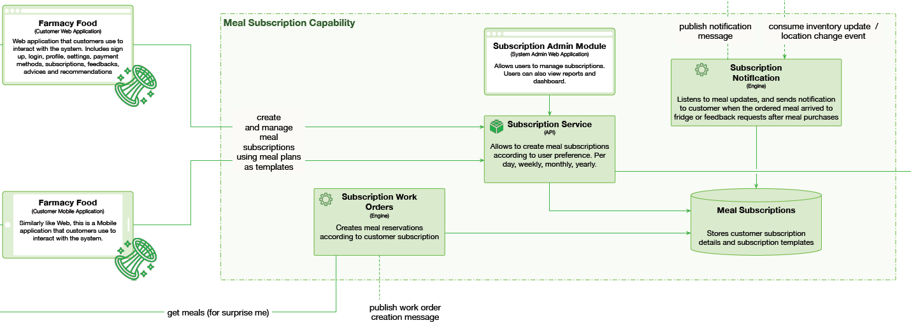

# Subscriptions capability

 

## The Rationale

Allow the customers to order individual meals as well as to subscribe to weekly, monthly etc food deliveries. Automate meal orders and meal status tracking. Notify customers about meal arrivals. Tolerate peak times. High availability for customers.

## Use cases

* Customers can view, browse, search and select meal delivery subsctiptions from the list of available subscription plans. 
* The customer may specify length of the subscription, and which meal to receive at each day, or at intervals. 
* The customer may specify a fridge to deliver the meal, individually for each day or for whole subscription period.
* The customer must be able to compose a subscription using available meal types from meals inventory. 
* Subscription plan will be executed by generating meal order messages to kitchen, which would include customer's preferred fridge for that day. 
* Administrators must be able to manage subscriptions, and view reports and dashboards.
* Customers will be notified when the meal arrives to the fridge.

## Components

* Subscription Admin application. Allows admin access to subscriptions DB
* Subscription Service API. Allows customers to create meal subscriptions according to user preference. Per day, weekly, monthly, yearly.
* Subscription Work Orders Engine. Creates kitchen work orders according to customer subscription.
* Subscription Notificaiton engine. Listens to meal status events over event bus, and sends notification to customer when the ordered meal arrived to fridge. Schedules feedback requests a set time after meal purchases.

## Architectural characteristics

* Availability
* Performance
* Elasticity
* Fault-Tolerance

## Architectural choice

* Event Driven