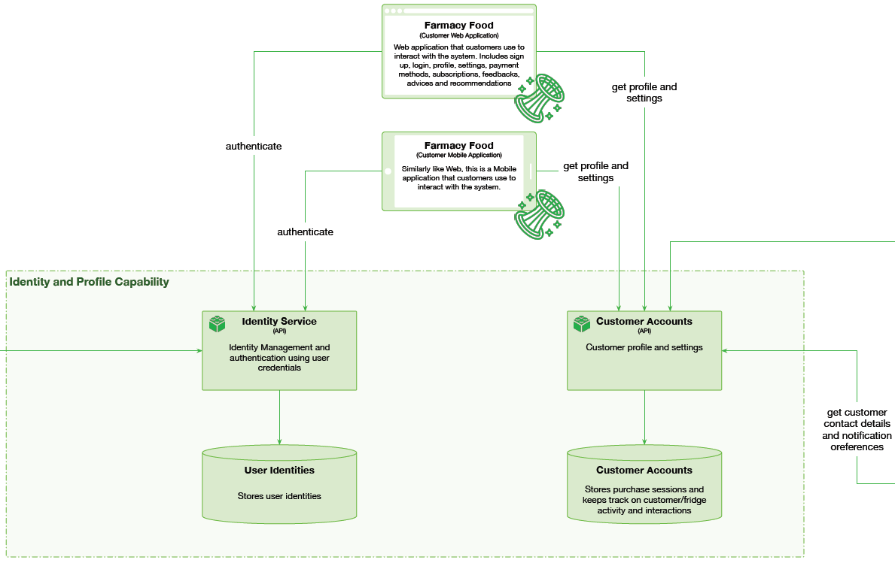

# Identity and Profile

 

## Capability rationale and description

Identity services are essential if we customers are to subscribe to meals, receive personal notifications, receive identity tokens, and order personalized meals and meal plans. Customer profiles will store dietary preferences, and health data that the experts could use to provide personal customer advice. At the very detailed level this would also require __Encryption__ capability at the infrastructure level for encrypting highly sensitive data like PII or personal data highly sensitive data. __Encryption__ capability will als manage re-encryptions and key rotations periodically.

## Use cases

* Purchase session queries customer identity from __Identity Service__ to verify if the customer has a meal waiting for him in the fridge.
* Purchase session queries customer identity from __Identity Service__ to query customer credits.
* Applications authenticate the customer via __Identity Service__.
* __Notifications Scheduler__ gets customer contact details and notification preferences.
* Referrals and Rewards engine updates customer credits.

## Components

* Identity Service API. Accessed for Identity Management and authentication using user credentials.
* Customer Accounts API pro vides customer profile and settings.
* User Identities DB.
* Customer accounts DB.

## Architectural characteristics

* Availability.
* Fault tolerance.
* Performance.
* Elasticity.
* Security

## Architectural choice

* Microservices
