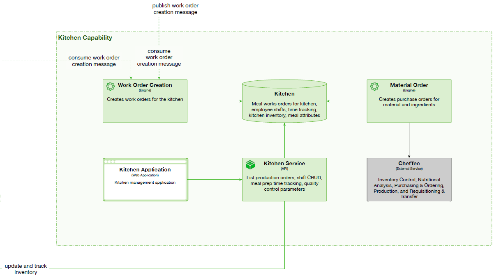

# Kitchens

 

## Capability rationale and description

The kitchen orders and delivery must become automated to handle customer demand and to support the subscription capability. It should also allow admin interface to monitor kitchen loads, orders inflow and outflow, and manage relevant supplies purchases. The __Kitchen Capability__ begins with manual work order creation by the admins, an expands with the addition of __Subscription Capablity__ to support automated order creation. The capability interfaces with external services like ChefTech for Inventory Control, Nutritional Analysis, Purchasing & Ordering, Production, and Requisitioning & Transfer. 

## Use cases

* Creation of manual work orders.
* Creation of automated work orders from subscription.
* Order and manage supplies.
* Manage kitchen operations.
* Allows managing several kitchens in different locations.

## Components

* Kitchen Application for kitchen, orders and supplies management.
* Kitchen Service API. List production orders, shift CRUD, meal prep time tracking, quality control parameters.
* Work Order Creation engine. Creates work orders for the kitchen.
* Material Order engine. Creates purchase orders for material and ingredients.
* Kitchen DB. List production orders, shift CRUD, meal prep time tracking, quality control parameters. 

## Architectural characteristics

* Interoperability.
* Workflow.
* Integration.
* Single DB.
* Domain partitioning.
## Architectural choice

* Service-oriented.
