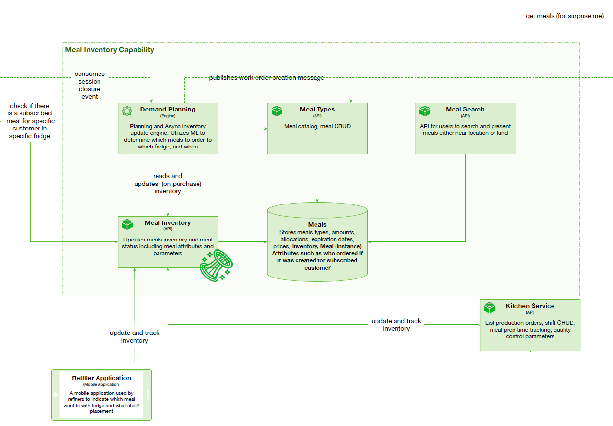

# Meal Inventory

 

## Capability rationale and description

The system needs to manage meal types (recipes) and individual meals thoughout the meal life cycle. The system should monitor fridges inventory and issue work order messages to kitchen ahead of anticipated shortages. The system also gathers data and issues events for the Data Platform. The system should provide single point of access for admins to monitor meal status and meal inventories, for admins and food experts to CRUD and price meal types, and for customers to search and browse fridges for available meals and meal types for orders. Must be highly available, must scale with business, must handle peak demand.

## Use cases

* Admins and experts CRUD and price meal types.
* Customers search meal types to create online orders and subscriptions.
* Customers to search currently available meal types in fridges.
* Demand planning system and admins monitor inventory to create timely meal orders.
* Refiller, kitchen, and purchase session update meal status. 

## Components

* Meal Inventory API. Updates meals inventory and meal status including meal attributes  and parameters.
* Demand Planning engine. Planning and Async inventory update engine. Utilizes ML to determine which meals to order to which fridge, and when.
* Meal Types API. Meal types catalogue and CRUD.
* Meal Search API. API for users to search and present meals with filters (either near location or of type etc).
* Meals DB. Stores meals types, amounts, allocations, expiration dates, prices,  inventory, Meal (instance), attributes such as who ordered if it was created for subscribed customer. Can be separate databases for inventory and types.

## Architectural characteristics

* Availability.
* Fault tolerance.
* Scalability.
* Elasticity.
* Possible several DBs.

## Architectural choice

* Microservices
* Event driven

## Relevant ADR(s)

* [Dedicated store for fast access meal-customer record](../ADRs/Dedicated%20store%20for%20fast%20access%20meal-customer%20record.md)
* [Meal inventory updates](../ADRs/Meal%20inventory%20updates.md)
