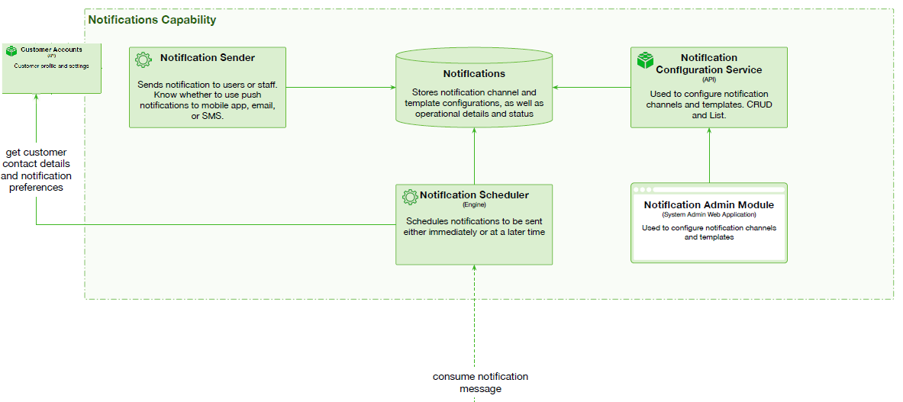

# Notifications Capability

 

## Capability rationale and description

__Farmacy Food__ needs to be able to send out notifications to customers accross several communication channels, which could be added and configured separately, but all should support certain types of messages and message formats. The main types of notifications are meals status updates such as arrival of meal to the fridge - the kitchen tags each meal with a barcode and has the customer name of it, which the Work Order Engine has provided. When the customer picks up the meal, and the purchase is finalized, Purchase Session API publishes another meal status message to the system, consumed by the Notification Scheduler, which schedules  a second, delayed customer notification, to collect the customer feedback. Feedback and Ranking service processes and stores the feedback for further consumption by the experts and other customers, and for the analysis by the system.
The system must send promotional material, nutritional advice and updates from the system and from experts. The system must to consume meal status events, access customer profiles for contact details, needs to be highly reliable. There is also need for elasticity, as there will be more messages at peak times. 

## Use cases

* Send meal arrival message to customer, possible other meal status messages as well.
* Send feedback request to customer a set time after meal is purchased.
* Send promotional material, nutricional advice and updates to customer.

## Components

* Notification Scheduler engine. Schedules notifications to be sent either immediately or at a later time.
* Notification sender. Sends notification to users or staff. Know whether to use push notifications to mobile app, email, or SMS.
* Notification configuration service API.  Used to configure notification channels and templates. CRUD and List.
* Notifications DB. Stores notification channel and template configurations, as well as operational details and status. Stores scheduled messages.

## Architectural characteristics

* Elasticity.
* Fault tolerance.
* Plugin support.

## Architectural choice

* Microkernel for Notifications Sender.
* The rest is microservices and event-driven.

## Relevant ADR(s)

* [Notifications scheduler to handle customer notifications](../ADRs/Notifications%20scheduler%20to%20handle%20customer%20notifications.md)
* [Notifications sender to handle several notifications channels](../ADRs/Notifications%20sender%20to%20handle%20several%20notifications%20channels.md)
* [Separate channels for anonymous and personal meal status messages](../ADRs/Separate%20channels%20for%20anonymous%20and%20personal%20meal%20status%20messages.md)
* [Subscriptions meal ordering and meal tracking separation](../ADRs/Subscriptions%20meal%20ordering%20and%20meal%20tracking%20separation.md)