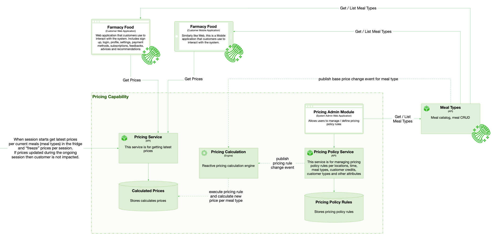

# Pricing

 

## Capability rationale and description

The system needs to implement a flexible pricing policy. The base price for a meal will be held in meals inventory. Additional to that, final meal price should be modified various pricing policies, according to time, place, customer type etc. The price must be recalculated when the policies or base price change, or when certain policies start or end. The customers should be able to see the final price at purchase or via the application. The system must be highly available and elastic to support the all purchases at peak times.

## Use cases

* Customers see the price of the meal in the applicaion, with high availability and reliability. When session starts get latest prices per current meals (meal types) in the fridge and “freeze” prices per session. If prices updated during the ongoing session then customer is not impacted. 
* Customers see the price of the meal at the fridge during purchase, when they open the door, with high availability and reliability.
* Admins CRUD the pricing policies, which should recalculate the price.
* Admins change base meal prices, which should recalculate the price.

## Components

* Pricing Policy Service API. This service is for managing pricing policy rules per locations, time, meal types, customer credits, customer types and other attributes.
* Pricing calculation engine. Reactive engine. Consumes events of policy or base meal price change, or when certain policies start or end, recalculates the price and stores it in calculated prices DB for high availability. 
* Pricing Service API for getting the latest prices via app or by fridge purchase session.High availability, high fault-tolerance.
* Pricing policy rules DB, stores policies.
* Calculated prices DB, stores calculated prices for high availability access.

## Architectural characteristics

* Fault Tolerance.
* Availability.
* Elasticity.

## Architectural choice

* Event-driven. Separate microservices API for price calculation and price access API. 

## Relevant ADR(s)

* See [Separate microservices for prices acces and calculation ADR](../ADRs/Separate%20microservices%20for%20prices%20acces%20and%20calculation.md) for relevant architectural decision.  

