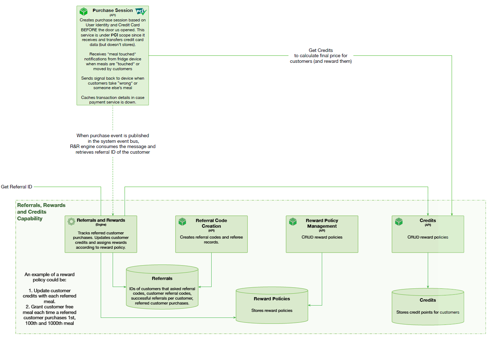

# Referrals and Rewards

 

## Capability rationale and description

To make the system viral, __Farmacy Food__ should allow the customers to share referral codes via messaging services and social networks, and reward them for successful referrals. Customers can refer their friends and family to the Farmacy Food main site, or even to send them a link to a particular public meal plan, expert. A successful referral is a registration and a completion of the first purchase. The link would contain the referral code, stored in Referrals Database, and if the addressee choses to subscribe and become a paying customer, the Purchase Session API would include the referral code in the meal status message at purchase finalization. The Referrals and Rewards Engine would consume the message, increase the customer’s credit ranking, and reward the customer according to the Rewards Policy, managed by the administration. Since the referral code would be stored in the new customer profile, the referring customers can be granted special rewards for the 100th or even a 1000th purchase by their friends or family members.  

An example of a reward policy could be: 
    1. Update customer credits with each referred meal.
    2. Grant customer free meal each time a referred customer purchases 1st, 100th and 1000th meal.  

The calculated price obtained by Purchase Session from Pricing is further modified by the purchase session according to customer's reward policy.
When purchase event is published in the system event bus, R&R engine consumes the message and retrieves referral ID of the customer.

## Use cases

* Allow the customer to share referral codes.
* Reward the customer for successful referrals by increasing his credit ranking, and offer discounts and other rewards according to ranking.

## Components

* Referral Code Creation API. Creates referral codes and referee records.
* Reward Policy Management API. CRUD reward policies.
* Credits API, CRUD user's credits according to reward policies.
* Referrals and Rewards engine. Tracks referred customer purchases. Updates customer
credits and assigns rewards according to reward policy.
* Referrals DB. Stores IDs of customers that asked referral codes, customer referral codes, successful referrals per customer, referred customer purchases.
* Reward Policies DB. Stores reward policies.
* Credits DB. Stores credit points for customers.

## Architectural characteristics

* High availability for purchase session API to get customer credits. 
* High fault tolerance for customer credits and referrals storages.
* Elasticity durign peak times.

## Architectural choice

* Microservices, event driven.

