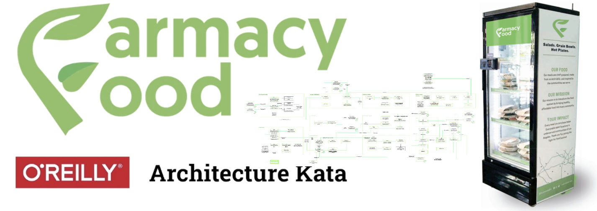

# The "Farmacy Food" System  

  

## Prelude  

All successful business stories start with a problem to solve. In this case, all began with a very personal pain. Kwaku, the person who originated the idea of "Farmacy Food", was passing over challenges in his business venture. Kwaku’s energy level was low, his time was extremely limited, and his mind was preoccupied by anything but maintaining a healthy diet. It was then, when a thought of how to get a healthy food without worrying about its quality or wasting too much precious time on preparing it came to Kwaku’s mind and struck a business chord. Modern entrepreneur is a high pressure business machine, and a well-functioning machine needs high quality fuel provided when necessary. We are what we eat. We function as we eat. It is especially important in these trying times, where COVID-19 wreaks havoc in the restaurants and food markets. Kwaku already has the dots - the kitchen, the fridges, the locations. Our goal as a team is to help him to connect the dots, by creating a system that can grow, expand, thrive and benefit both - the owners and the community as a whole.

## The Vision  

Any system or business usually have humble beginnings and then grow organically into something more. The question is, into what. In the beginning all __Farmacy Food__ has is a - kitchen, the fridges, and a modest accounting and payment capabilities managed via __QuickBooks__. Our vision is to build up from these capabilities and to evolve __Farmacy Food__ into a meeting place and even a social network, where health experts and customers can live the motto of business founder, Kwaku: "Let thy food be thy medicine". There, they would exchange their experiences, meal plans and health related content. Plus, with the underlying __Farmacy Food__ infrastructure customers will purchase meals or subscribe to whole meal plans from the experts of their choice, with a guarantee of delivery to the smart fridge near them. Our conviction is that we are not creating a mere IoT and logistical mechanism. With our architecture we would love to create an impact by building long living “healthy eating communities” and help Kwaku’s business grow fast, organically and in a cost effective way.

## Business Requirements  

#### Short term  

* Support for third party smart fridges
* Monitor smart fridges inventories and customer purchases
* Generate work orders to kitchen based on inventory status
* Scale to multiple locations in the city, thousands of users

#### Mid term  

* Allow customer feedback and customer surveys
* Allow customer subscriptions
* Scale nationally, hundreds of thousands of users.
* Allow referrals and referree rewards
* Allow coupons and promotions

#### Long term  

* Support partnerships and donations
* Connect customers with health food experts for dietary counseling
* Establish a platform for engagement between health food professionals and the community.
* Establish a social network around the motto of _"Let thy food be thy medicine"_.

##  The Strategy  

Modern technologies and Cloud enable rapid experimentation and development of distributed systems that were considered very complex several years ago. Within a few clicks or lines of code we can spin out a whole environment with databases, message brokers and microservices securely deployed in the Cloud of our choice. We can then gradually and continuously experiment our ideas, hypothesis and thus delight our customers with solving they toughest pains. Therefore, our strategy is to define initial architecture based on customer feedbacks as an ideal target state (which of course will evolve) and aim to to that. Here, we see no benefit in investing time and effort in creating technical debt and building monolithic systems or components which will require refactoring and re-engineering in the future. 
Of course if we experiment with something that we don’t know we can do temporary trade-offs and simplifications, but we should have a very clear reason for __NOT__ aiming to the ideal target state. Unless, we are building a minimum viable product for rapid experimentation with new hypothesis and we are not sure about future requirements, customer needs or market. Our main principle is that "we are not rich enough to buy cheap things".

 [Here](./Strategy.md) is a detailed strategy how we plan to scale and expand our architecture to empower __Farmacy Food__ and achieve its full potential.  

## The Architecture  

* [General Architecture](./GeneralArchitecture.md) - the general architectural idea.  

#### Stage 1 Capabilities  

* [Fridge Capability](./Key%20Capabilities/Fridge%20Capability.md)
* [Card and Payment](./Key%20Capabilities/Card%20and%20Payment.md)
* [Identity and Profile](./Key%20Capabilities/Identity%20and%20Profile.md)  
* [Kitchen Capability](./Key%20Capabilities/Kitchens.md)
* [Meal Inventory](./Key%20Capabilities/Meal%20Inventory.md)
<<<<<<< HEAD
* [Pricing Policies](./Key%20Capabilities/Pricing%20Policies.md)
=======
* [Pricing](./Key%20Capabilities/Pricing%20policies.md)
>>>>>>> fc675b6101014fa483c00f1e1cc23f3ac8d28313

#### Stage 2 Capabilities  

* [Customer Subscriptions](./Key%20Capabilities/Customer%20Subscriptions.md)
* [Notifications](./Key%20Capabilities/Notifications.md)
* [Feedback and Ranking](./Key%20Capabilities/Feedbacks.md)  

#### Stage 3 Capabilities  

* [Data Platform](./Key%20Capabilities/Data%20Platform.md)
* [Referrals and Rewards](./Key%20Capabilities/Referrals%20and%20Rewards.md)
* [Expert Platform and CMS](./Key%20Capabilities/Experts%20Platform.md)  

## Workflow  

* [Customer journey](./Workflow%20and%20Journeys/CustomerJourney.md)
* [Meal journey](./Workflow%20and%20Journeys/MealJourney.md)
* [Expert Workflow](./Workflow%20and%20Journeys/ExpertWorkflow.md)  

## Architectural Desision Records (ADRs)  

You can find the Architectural Decision Records [here](https://github.com/TheJedis2020/arch_katas_2020/tree/main/ADRs)  

# Directory Structure

- [ADRs](https://github.com/TheJedis2020/arch_katas_2020/tree/main/ADRs) - contains all architecture decisions and assumptions
- [diagrams](https://github.com/TheJedis2020/arch_katas_2020/tree/main/diagrams) - contains architecture diagrams (also available as a singe [PDF file](https://github.com/TheJedis2020/arch_katas_2020/blob/main/diagrams/FarmacyFood.pdf))
	- [Legend](https://github.com/TheJedis2020/arch_katas_2020/blob/main/diagrams/Legend.jpg)
	- [System Overview and Use Case Diagram](https://github.com/TheJedis2020/arch_katas_2020/blob/main/diagrams/System%20Overview%20and%20Use%20Case%20Diagram.jpg)
	- [System Component Diagram](https://github.com/TheJedis2020/arch_katas_2020/blob/main/diagrams/System%20Component%20Diagram.jpg)
	- [Data Platform Diagram](https://github.com/TheJedis2020/arch_katas_2020/blob/main/diagrams/Data%20Platform%20Diagram.jpg)
- [Key Capabilities](./Key%20Capabilities/)
- [Workflow and Journeys](./Workflow%20and%20Journeys/)

